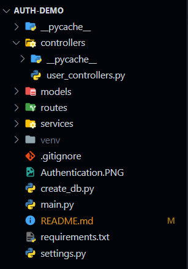

# Authentication and Authorization using Starlette.

> Starlette is a lightweight framework for building asynchrnous web applications and APIs.

## Some of it's features include
1. A lightweight, low-complexity HTTP web framework.
2. WebSocket support.
3. In-process background tasks.
4. Startup and shutdown events.
5. Test client built on httpx.
6. CORS, GZip, Static Files, Streaming responses.
7. Session and Cookie support.
8. 100% test coverage.
9. 100% type annotated codebase.
10. Few hard dependencies.
11. Compatible with asyncio and trio backends.
12. Great overall performance against independent benchmarks.

> Starlette uses uvicorn which is an ASGI web server. An ASGI server is an asynchronous web server. As the term suggests, an asynchronous web server is able to handle requests asynchronously. <strong>i.e, it handle multiple requests paralally on multiple threads.</strong> Unlike other frameworks like Django and flask that use a WSGI server for handeling requests, they are comparatively faster. A WSGI server on the other hand is not asynchronous. <strong>Frameworks that use a WSGI server make use of multiple workers to handle incoming requests.</strong> A worker is referred to a CPU thread.

## Authentication in Starlette
> Python frameworks like Django provide their own authentication systems simplifying development. However, they may not provide enough  customization options. Django's authentication methods are also not best designed for NoSQL databases.

> Starlette on the other hand being an ASGI server is also easily scalable and in terms of authentication and authorization, it is easy to implement various authentication methods in starlette such as Token Based Authentication (JWT) or Cookie-based authentication. Starlette also makes it easier to implement authentication based on other Schema dependencies or other external authentication providers like Google.

### AuthenticationBackend
Starlette provides a base "AuthenticationBackend" class from which we can extend to create a custom authentication backend(s).

### AuthenticationMiddleware
AuthenticationMiddleware is used to authenticate requests in starlette. The AuthenticationMiddle takes a list of AuthenticationBackends which are simply custom user authentication methods. The middleware runs all the AuthenticationBackends until each one of them successfylly authenticate the user. The AuthenticationMiddleware is provided as a parameter of the main Starlette app in the **main.py** file.

# Tools and Technologies
1. Starlette - ASGI python web framework.
2. SQLAlchemy - Object Relational Mapper (ORM) used for creating user Schemas.
3. Bcrypt - Password hashing library.
4. PyJWT - Library for JWT authentication in Python.
# Project Structure
This repository contains a project for demonstrating the authentication and authorization using Starlette.

## Settings.py
The Settings.py contains the global variables and the initialization of different variables used in our applicaion such as the SqlAlchemy engine and the declarative_base.
## Main.py
The **main.py** file is the root file that is run in order to start our starlette server. This is where our routes, middlewares and the Starlette application's instrance is defined.
## Models
The models directory consists of the SQLAlchemy schema models in our application. It consists the User.py file which is a schema of our User model.
## Routes
Our application routes can be sub-divided into multiple nested routes for easier scalability.
The routes directory contains files for each parent routes. For instance, the **user_routes.py** file contains the routes associated with user actions such as login and registration.
## Controllers
The controllers are the middwares or the intarface that handle the requests to our servers. Similar to the routes, the controllers are also divided into multiple files increasing scalability. 
## Running the server.
As our starlette application uses uvicorn ASGI server, in order to run our application, we can run the following command in our terminal.
> uvicorn main:app

# Authentication routes.
The **/user** route consists other routes nested for the login and registration.
> The **/user/register** route accepts POST requests with username, email and password in the body for registering a new user into the database.

> The **/user/login** route accepts POST requests with username and password in the body and returns a JWT token as a response if the credentials are matched.